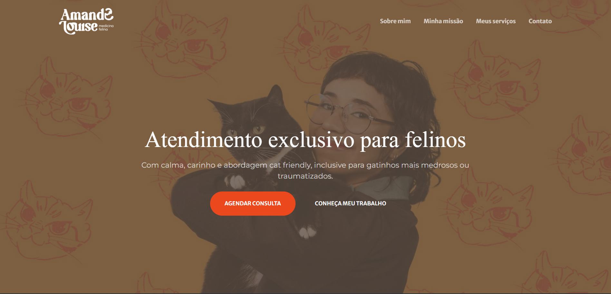
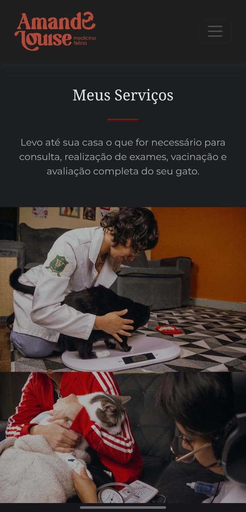

# 🐱 Amanda Felinos | Veterinary Landing Page

Landing page responsiva desenvolvida para uma médica veterinária especializada em felinos, com foco em apresentação profissional, construção de autoridade e conversão de visitantes em clientes via WhatsApp.

## 🌐 Deploy

🔗 https://amandafelinos.com.br/

---

## 🎯 Objetivo do Projeto

Desenvolver uma landing page moderna e eficiente para:
- Apresentar os serviços veterinários especializados em gatos
- Transmitir confiança e profissionalismo
- Facilitar o contato direto com a cliente
- Converter visitantes em atendimentos

---

## 🚀 Tecnologias Utilizadas

- HTML5
- CSS3
- JavaScript
- Bootstrap
- Vercel (deploy e hospedagem)
- Vercel Analytics

---

## ✨ Funcionalidades

- Layout totalmente responsivo (desktop e mobile)
- Estrutura em seções com navegação fluida
- CTA (Call to Action) para contato via WhatsApp
- Apresentação de serviços
- Seção institucional (sobre)
- Área de prova social
- Integração com Instagram
- Formulário de contato
- Monitoramento de acessos com Vercel Analytics

---

## 📸 Preview

### 🖥️ Desktop

### 📱 Mobile

---

## 🎬 Demonstração (GIF)

---

## 📊 Monitoramento e Métricas

O projeto conta com integração de analytics para acompanhamento de:
- Número de visitantes
- Páginas mais acessadas
- Comportamento geral de navegação

Essa implementação permite futuras otimizações baseadas em dados reais de uso.

---

## 📌 Considerações

Este projeto representa uma aplicação real, com foco em resolver uma necessidade prática de negócio: presença digital e captação de clientes.

Mais do que apenas uma interface, a landing page foi pensada como uma ferramenta de conversão e análise de comportamento do usuário.

---

## 👨‍💻 Autores

Desenvolvido por

**Luan Cordeiro**
- 💼 LinkedIn: https://www.linkedin.com/in/luan-cordeiroo/
- 💻 GitHub: https://github.com/Luanlrc

**Fabio Alves**
- 💼 LinkedIn: https://www.linkedin.com/in/fabiofigueiredoalves/
- 💻 GitHub: https://github.com/fabiofalves

---
